# WARDOGS Autopilot


Autonomous delivery autopilot for WARDOGS.
This project captures the in-game minimap, localizes the vehicle on full game maps using offline SIFT feature indexes, and drives the supply truck with WASD/Space keystrokes. Windows software keyboard input is the default; Arduino Micro USB HID input remains available.

## Software keyboard (Windows, no Arduino required)

Set `navigator.key_source` to `"software"` in `config.json` (the default).
The driver uses Windows `SendInput` scan codes through Python's standard library;
no extra keyboard package or serial device is needed. See Microsoft's
[KEYBDINPUT documentation](https://learn.microsoft.com/en-us/windows/win32/api/winuser/ns-winuser-keybdinput).

Install dependencies and prepare map assets as below, then run `python main.py ui`.
Calibrate the minimap capture region and load a route with at least two points.
Bring the game to the foreground, then press **F6** to start/stop following;
**F7** releases keys and stops the driver. Software input goes to the foreground
application, so stop following before switching windows. The driving logic uses
W/A/S/D/Space only and does not need mouse input.

Held keys are released on normal exit, emergency stop, or after approximately
200 ms without a fresh command (checked every 50 ms). The software watchdog runs
inside the Python process; it cannot recover from a forcibly terminated or frozen
process. Game acceptance of synthetic input still needs an in-game test. SendInput
failure is reported by the driver; the software mode does not bypass game input restrictions.

To use hardware input again, set `navigator.key_source` to `"arduino"` and set
`navigator.port` to the connected serial port.

## Features
- **SIFT Feature Index Localization**: Radius-based search on multi-scale tile feature indexes (`*_feat.npz`), delivering ~0.2 px precision in ~1.5s cold start and sub-second tracking.
- **Hardware-Level Input Injection**: Arduino Micro emulates real USB keyboard keypresses, bypassing OS-level software injection restrictions. 200 ms watchdog auto-releases keys on connection loss.
- **Interactive Studio GUI**: Tkinter desktop studio with minimap ROI calibration, real-time map viewer with pan/zoom, visual waypoint route editor, map cache & SIFT index management, and global hotkeys (**F6** toggle follow, **F7** emergency stop).
- **Multi-Map Support**: Three game maps (Zestafona, Bakurani, Ozeti) with automatic mipmap pyramids and grayscale signature tracking for cache invalidation.
- **Vote-Gated Relocalization**: Configurable inlier voting across multiple frames prevents false-positive jumps during map matching.

## System Architecture

```mermaid
%%{init: {
  'theme': 'base',
  'flowchart': { 'curve': 'basis', 'nodeSpacing': 45, 'rankSpacing': 65, 'wrap': true },
  'themeVariables': {
    'fontSize': '14px',
    'primaryColor': '#37474F',
    'primaryTextColor': '#ffffff',
    'primaryBorderColor': '#78909C',
    'lineColor': '#90A4AE',
    'secondaryColor': '#37474F',
    'tertiaryColor': '#37474F'
  }
}}%%
flowchart LR
    subgraph Game["Game Machine"]
        direction TB
        Screen(["Game Window"])
        Minimap[/"Minimap Region"/]
        Capture["Screen Capture<br/>mss"]

        Screen -->|ROI crop| Minimap
        Minimap -->|Grab frame| Capture
    end

    subgraph Autopilot["Autopilot Application"]
        direction TB
        Locator["SIFT Matcher<br/>FeatureIndex"]
        Tracker["Position Tracker<br/>LiveLocator thread"]
        Nav["Navigation<br/>FollowDriver"]
        UI["Studio GUI<br/>Tkinter"]

        Locator -->|Pose + heading| Tracker
        Tracker -->|Position stream| Nav
        Tracker -->|Position stream| UI
        Nav -->|Key mask| UI
    end

    subgraph HW["Hardware"]
        direction TB
        Arduino["Arduino Micro<br/>ATmega32U4"]
        Keys(["USB HID<br/>WASD + Space"])

        Arduino -->|Emulated keypresses| Keys
    end

    Capture -->|Grayscale frame| Locator
    Nav -->|Serial byte mask| Arduino
    Keys -->|Input injection| Screen

    classDef core fill:#1565C0,stroke:#90CAF9,stroke-width:1.5px,color:#ffffff
    classDef bridge fill:#E65100,stroke:#FFCC80,stroke-width:1.5px,color:#ffffff
    classDef app fill:#2E7D32,stroke:#A5D6A7,stroke-width:1.5px,color:#ffffff
    classDef hw fill:#AD1457,stroke:#F48FB1,stroke-width:1.5px,color:#ffffff

    class Screen,Minimap,Capture core
    class Locator,Tracker,Nav,UI app
    class Arduino,Keys hw

    style Game fill:none,stroke:#78909C,stroke-width:1px,color:#90A4AE
    style Autopilot fill:none,stroke:#78909C,stroke-width:1px,color:#90A4AE
    style HW fill:none,stroke:#78909C,stroke-width:1px,color:#90A4AE
```



## Project Structure

```text
wardogs-autopilot/
├── main.py                     # CLI & GUI entry point
├── config.json                 # Primary configuration
├── autopilot.bat               # Windows launcher (pythonw, no console)
├── pyproject.toml              # Build & dependency configuration (uv / pip)
├── arduino/
│   └── keyboard_emulator/      # ATmega32U4 firmware (byte mask → HID WASD/Space)
├── data/
│   ├── maps/                   # Map catalog, SIFT indexes (*_feat.npz), mipmaps
│   ├── masks/                  # Minimap static mask (mm_mask.png)
│   └── presets/                # Saved waypoint route JSON presets
├── src/autopilot/              # Main application package
│   ├── common/                 # Typed config (Pydantic), logging & crash reporting
│   ├── hardware/               # ScreenCapture (mss) & ArduinoKeyDriver (serial)
│   ├── navigation/             # FollowDriver, PathTracker, Speed & Steering controllers
│   ├── ui/                     # Tkinter studio GUI, interactive canvas, tab controllers
│   └── vision/                 # MapStore, FeatureIndex, SIFT matcher, position tracker
├── tests/                      # 33 unit & regression tests
└── tools/                      # Developer CLI utilities
    ├── download_map.py         # Map asset downloader from GitHub Releases
    ├── nav_dbg.py              # Navigation trace inspector & tailer
    ├── selfcheck_features.py   # Offline feature index regression checker
    └── map_match_debug.py      # Frame matching collage analyzer
```

## Tech Stack
- **Vision**: Python 3.11, OpenCV (SIFT), NumPy
- **Hardware**: Arduino Micro (ATmega32U4), PySerial
- **Capture**: mss (multi-monitor screen grab)
- **GUI**: Tkinter
- **Config & Validation**: Pydantic 2.0
- **Testing**: Pytest, Ruff, mypy

---

## Getting Started

### Prerequisites
- Python 3.11+
- [uv](https://docs.astral.sh/uv/) package manager *(recommended)* or pip
- Windows for software input; alternatively Arduino Micro (ATmega32U4) connected via USB (default: `COM6`)

### Step 1: Install Dependencies

```bash
# Using uv (installs all runtime and dev dependencies deterministically):
uv sync

# Or using pip:
pip install -e ".[dev]"
```

### Step 2: Download Map Assets

High-resolution game maps (up to 32768×32768) are hosted on GitHub Releases:

```bash
# List available maps and their download status:
python tools/download_map.py --list

# Download a specific map:
python tools/download_map.py zestafona

# Or download all maps at once:
python tools/download_map.py --all
```

### Step 3: Flash the Arduino Firmware (Arduino mode only)

Compile and upload the keyboard emulator sketch to the Arduino Micro using Arduino CLI.

### Step 4: Run the Application

```bash
python main.py ui
```

Or double-click `autopilot.bat` (launches windowless via `pythonw.exe`).

---

## Configuration

### Updating older localization indexes

After updating from the original raw-feature matcher, open **Capture zone**,
select your map under **Map Cache & SIFT Feature Index**, and click
**Rebuild Cache & SIFT Index**. Wait for completion, then restart the application.
Existing raw indexes are marked outdated and cannot be used by the new matcher.

The index now uses percentile-normalized tiles at 1.7x internal map resolution.
This preserves features in zoomed-in minimaps and matches the query's contrast
processing. Global acquisition searches the complete descriptor set with a
cached FLANN tree, filters matches in both directions, and requires an exact
local verification with at least eight inliers before publishing a position.
`locator.min_pose_scale` defaults to 0.25; collapsed, near-zero-scale transforms
remain rejected.

Index building can take several minutes. Large maps require more disk space
and memory: the tested 32768x32768 Zestafona image produced an approximately
1.3 GB feature index. At startup, **preparing full-map search index...** can last
tens of seconds; subsequent searches reuse that tree. The legacy
`global_max_features` sampling limit is no longer used by global acquisition.

Configuration is stored in `config.json` at the project root:
- `capture`: Monitor index, FPS, minimap ROI coordinates.
- `map`: Active map name (`zestafona`, `bakurani`, `ozeti`), dimensions, grayscale conversion.
- `navigator`: Serial port (`COM6`), speed caps, arrival/slow radii.
- `locator`: Feature matching thresholds, RANSAC inlier gates, voting parameters.

---

## Arduino Protocol

The Python driver communicates with the Arduino Micro over USB Serial (115200 baud):
- **1 byte command**: Bitmask of pressed keys:
  - `0x01`: 'W' (Throttle)
  - `0x02`: 'A' (Steer Left)
  - `0x04`: 'S' (Brake / Reverse)
  - `0x08`: 'D' (Steer Right)
  - `0x10`: 'SPACE' (Handbrake)
- `0xFF`: Reset / release all keys.
- **Watchdog**: Arduino automatically releases all keys if no command is received for 200 ms.

---

## Running Tests

```bash
# Full test suite (33 tests):
pytest

# Lint & code quality:
ruff check .
```

---

## License
This project is licensed under the MIT License — see the [LICENSE](LICENSE) file for details.


### Steering and capture alignment

The position marker represents the **center of the capture rectangle**. Select only
map imagery, excluding bottom HUD bars, and ensure the player icon is centered.
Map registration rotation is not vehicle heading, so the map views show a position
marker without a direction arrow.

Navigation uses recent movement to estimate direction. After F6, drive forward
briefly in a clear straight section until `wait_heading` changes to `run`. At rest,
or when direction evidence expires, automatic keys are released; it does not
infer a north-facing vehicle from a north-up map. This course estimate assumes
forward motion, not reversing. F7 stops and releases keys.

Steering is limited to pulses of at most 0.5 seconds, with a settling interval and
a new motion observation required before another pulse. Old `hold_max` and
`turn_deg` settings remain accepted for config compatibility but no longer enable
continuous steering. This does not establish a calibrated vehicle dynamics model;
validate at low speed before using longer routes.
